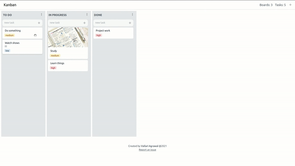
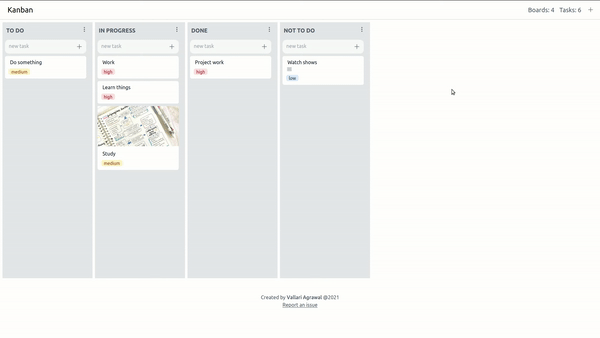
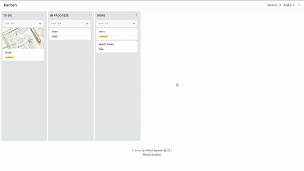
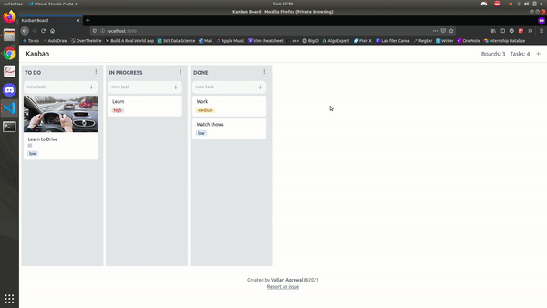

# Kanban Board

Kanban board to organize tasks.



## Install
Install [npm](https://docs.npmjs.com/downloading-and-installing-node-js-and-npm) and run:
```
npm install
```
## Run

To start local development server, run:
```
npm run start
```
## Use

Features: 

- Boards

    Add a board. Edit board titles. Move boards to right and left. Sort tasks by priority in a board.

    

- Tasks

    Add a task. Edit task details. Move tasks between boards and in same column.

    

- Store your data locally in browser

    


## Dependencies

- [TailwindCSS](https://tailwindcss.com/)
- [Material UI](https://material-ui.com/)
